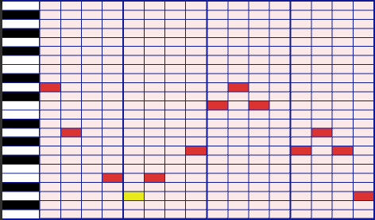

# Procedural Music Generator

A tool for generating melodies procedurally using Perlin noise. Designed for infinite, adaptive music — especially suited for open-world games.

## Quick start (web)

Open `index.html` in a modern browser. No build step or server required.

The generator creates melodies from Perlin noise controlled by seed, octaves, lacunarity, and persistence. You can pick a scale (major, minor, pentatonic, blues, chromatic), set BPM, and hear the result instantly through the Web Audio API.

## How it works

Perlin noise produces a smooth, deterministic curve from a given seed. That curve is mapped to pitch values and quantized to the chosen musical scale. Tweaking the noise parameters changes the character of the melody:

| Parameter | Effect |
|---|---|
| **Seed** | Determines the shape of the noise curve — same seed = same melody |
| **Octaves** | Number of noise layers combined. More octaves = more detail |
| **Lacunarity** | Frequency multiplier per octave. Higher = less smooth, more variation |
| **Persistence** | Amplitude retention per octave (0–1). Lower = smoother, dominated by the base shape |
| **Note range** | How many semitones the melody can span |
| **Length** | Number of notes generated |

**Tips:** try two melodies with the same parameters but different seeds, or use lower BPM with few octaves for a calmer feel.

## Project structure

| Path | Description |
|---|---|
| `melody.ts` | Core generator (Perlin noise + scale quantization) — source of truth |
| `melody.js` | Compiled output of `melody.ts` (checked in until a build step is added) |
| `app.js` | Web UI wiring (controls, keyboard rendering, playback) |
| `index.html` / `style.css` | Web interface |
| `Assets/` | Legacy Unity prototype with chords, arpeggios, MIDI integration, and multi-voice support |

## Roadmap

See [ROADMAP.md](./ROADMAP.md) for the detailed task list. High-level goals:

- [x] Procedural melody generation
- [x] Configurable scales and BPM
- [x] Dynamic piano keyboard visualization
- [ ] Rhythm and note duration control
- [ ] Harmony and chord tracks
- [ ] Bass line
- [ ] Multiple simultaneous voices
- [ ] MIDI file export
- [ ] Adaptive/parametric design for game integration

## Screenshot

The Unity prototype's sequencer grid (the web version uses an interactive piano keyboard):

## License

[MIT](./LICENSE) — Francisco Matheus Moreira de Castro, 2017
